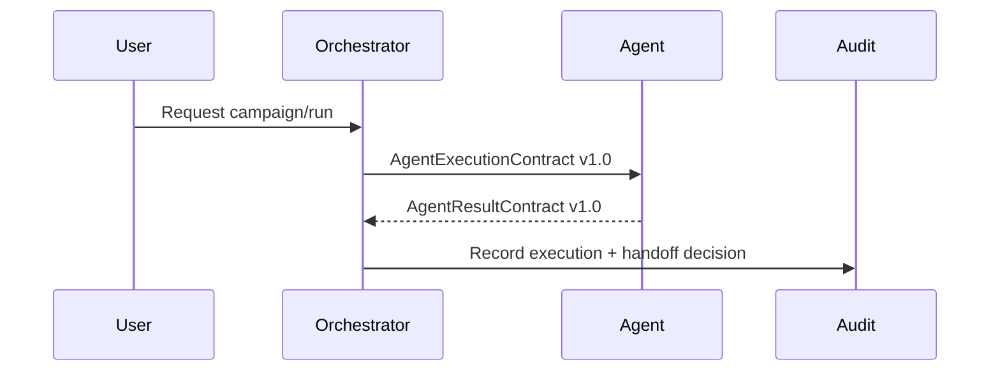

# Agent Execution Contract

## Purpose

Every ARA agent invocation must use a versioned execution envelope. The envelope carries operational context, not raw commercial payloads.

## Contract

```json
{
  "contract_version": "1.0",
  "tenant_id": "freelan",
  "campaign_id": "campaign_001",
  "run_id": "run_001",
  "candidate_id": "candidate_001",
  "correlation_id": "uuid",
  "agent": "discovery",
  "agent_version": "0.1",
  "requested_action": "discover_candidates",
  "trigger": {
    "type": "user",
    "actor_id": "internal-operator"
  },
  "input": {
    "filter_ref": "run_001.filters"
  },
  "constraints": {
    "external_services_mode": "mock",
    "write_mode": "disabled"
  },
  "retry": {
    "attempt": 1,
    "max_attempts": 3,
    "previous_execution_id": null
  },
  "created_at": "ISO-8601"
}
```

## Required Fields

| Field | Required | Notes |
|---|---:|---|
| `contract_version` | Yes | Start with `1.0`. |
| `tenant_id` | Yes | MVP default is `freelan`, resolved from `ARA_DEFAULT_TENANT_ID`. |
| `campaign_id` | Yes | May reference a legacy run during migration. |
| `run_id` | Yes | Current `import_runs.id` maps here initially. |
| `candidate_id` | No | Required for candidate-specific agents. |
| `correlation_id` | Yes | Propagated from HTTP/request context. |
| `agent` | Yes | Example: `discovery`, `data_intelligence`. |
| `agent_version` | Yes | Enables reproducible decisions. |
| `requested_action` | Yes | Verb-oriented action. |
| `trigger` | Yes | User, orchestrator, retry, schedule or webhook. |
| `input` | Yes | Prefer references over PII. |
| `constraints` | Yes | Includes service/write mode. |
| `created_at` | Yes | ISO-8601. |

## Supported Trigger Types

- `user`
- `orchestrator`
- `retry`
- `resume`
- `approval`
- `schedule`

## Handoff Rule

A candidate must not advance to the next agent only because it was saved in the database. Every handoff must produce:

- Structured result.
- Evidence.
- Confidence.
- State.
- Next action.
- Correlation ID.
- Agent version.
- Audit event.

The Orchestrator validates the result before invoking another agent.

## Async Readiness

ARA 0.1 may execute synchronously, but the contract is queue-safe: it includes IDs, retry metadata, tenant context and correlation context.



