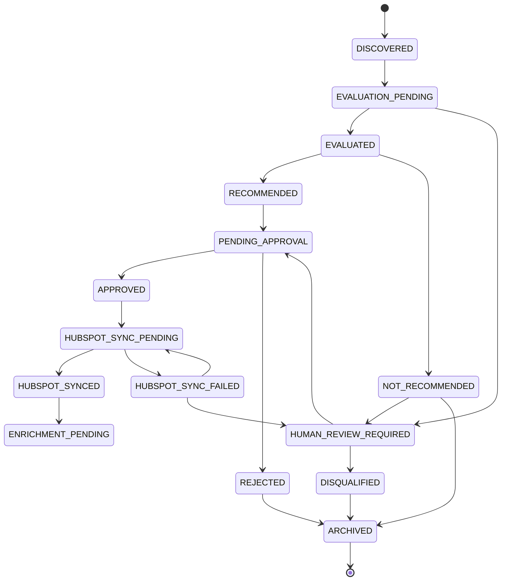

# ARA Candidate Lifecycle

## Primary And Sub-statuses

Primary commercial lifecycle: `lifecycle_status`.

Sub-statuses:

- `approval_status`
- `hubspot_sync_status`
- `enrichment_status`
- `context_status`
- `engagement_status`

Operators should see one simple label plus one clear next action.

## Lifecycle States

| State | Meaning | Entry Criteria | Previous | Next | Authorized Actor/Service | UI Label | Action | HubSpot Impact | Retry |
|---|---|---|---|---|---|---|---|---|---|
| `DISCOVERED` | Candidate found | Apollo/source result normalized | none | `EVALUATION_PENDING` | Discovery Agent | Discovered | Evaluate | None | Yes |
| `EVALUATION_PENDING` | Waiting scoring/evidence | Candidate persisted | `DISCOVERED` | `EVALUATED`, `HUMAN_REVIEW_REQUIRED` | Orchestrator | Evaluating | Wait | None | Yes |
| `EVALUATED` | Scores/evidence complete | Agent result valid | `EVALUATION_PENDING` | `RECOMMENDED`, `NOT_RECOMMENDED` | Orchestrator | Evaluated | Review | None | No |
| `RECOMMENDED` | Good fit | Scores pass threshold | `EVALUATED` | `PENDING_APPROVAL` | Discovery Agent/Orchestrator | Recommended | Send to approval | None | No |
| `NOT_RECOMMENDED` | Poor fit | Scores below threshold | `EVALUATED` | `ARCHIVED`, `HUMAN_REVIEW_REQUIRED` | Discovery Agent/Orchestrator | Not recommended | Archive/review | None | No |
| `PENDING_APPROVAL` | Needs human decision | Recommended candidate ready | `RECOMMENDED`, `HUMAN_REVIEW_REQUIRED` | `APPROVED`, `REJECTED` | Orchestrator | Pending approval | Approve/reject | None | No |
| `APPROVED` | Human approved | Approval event accepted | `PENDING_APPROVAL` | `HUBSPOT_SYNC_PENDING` | Commercial Approver | Approved | Sync to HubSpot | None yet | No |
| `REJECTED` | Human rejected | Rejection event accepted | `PENDING_APPROVAL` | `ARCHIVED` | Commercial Approver | Rejected | Archive | None | No |
| `HUBSPOT_SYNC_PENDING` | Awaiting sync | Approved candidate queued | `APPROVED` | `HUBSPOT_SYNCED`, `HUBSPOT_SYNC_FAILED` | HubSpot Sync Service | Sync pending | Sync | Pending | Yes |
| `HUBSPOT_SYNCED` | Synced to HubSpot | Contact/company IDs recorded | `HUBSPOT_SYNC_PENDING` | `ENRICHMENT_PENDING` | HubSpot Sync Service | Synced | Enrich | Contact/company created or updated | No |
| `HUBSPOT_SYNC_FAILED` | Sync failed | Safe HubSpot error | `HUBSPOT_SYNC_PENDING` | `HUBSPOT_SYNC_PENDING`, `HUMAN_REVIEW_REQUIRED` | HubSpot Sync Service | Sync failed | Retry/review | Partial or none | Yes |
| `ENRICHMENT_PENDING` | Ready for next agent | HubSpot sync completed | `HUBSPOT_SYNCED` | Future agent states | Orchestrator | Ready for intelligence | Continue | Existing HubSpot refs available | Yes |
| `HUMAN_REVIEW_REQUIRED` | Needs operator review | Low confidence/conflict | Any non-terminal state | `PENDING_APPROVAL`, `DISQUALIFIED` | Orchestrator/Operator | Needs review | Review | None | No |
| `DISQUALIFIED` | Policy/business disqualified | Disqualifier found | Any pre-sync state | `ARCHIVED` | Operator/Policy | Disqualified | Archive | None | No |
| `ARCHIVED` | No further processing | Rejected/disqualified/manual archive | `REJECTED`, `DISQUALIFIED`, `NOT_RECOMMENDED` | none | Operator/Admin | Archived | None | None | No |

## Candidate Lifecycle Diagram

## Approval Statuses

- `NOT_REQUIRED`
- `PENDING`
- `APPROVED`
- `REJECTED`
- `CHANGES_REQUESTED`
- `EXPIRED`

Approval is also a durable event; the field is only the latest aggregate state.

