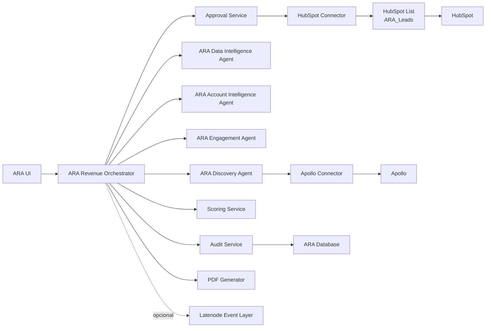

# Plan De Migracion Incremental A ARA

## Objetivo

Evolucionar el sistema actual hacia **ARA - Autonomous Revenue Architects**, usando el prototipo como base del **ARA Discovery Agent** sin romper el flujo Apollo -> HubSpot existente.

## Principios

1. No reescribir todo al inicio.
2. Separar componentes por responsabilidad antes de sumar agentes.
3. Proteger escritura en HubSpot antes de ampliar usuarios.
4. Auditar cada decision y cada writeback.
5. Mantener aprobacion humana en acciones irreversibles o costosas.
6. Construir inicialmente para uso interno de Freelan, pero dejando preparada la configuracion por cliente para un modelo plug and play futuro.
7. Escribir leads en HubSpot dentro de una lista especifica `ARA_Leads` como frontera operacional inicial.
8. Mantener Latenode como capa opcional, no como dependencia obligatoria del MVP.

## Decisiones de arquitectura confirmadas

| Tema | Decision |
|---|---|
| Mercado inicial | Uso interno Freelan |
| Evolucion futura | Producto plug and play para clientes con sus propias cuentas de HubSpot y Apollo |
| Tenancy | Preparar desde el inicio configuracion por cliente/tenant, aunque el primer tenant sea Freelan |
| Aprobaciones | Operador, admin y aprobador comercial como niveles recomendados |
| Escritura en HubSpot | ARA debe escribir en una lista especifica `ARA_Leads` |
| Latenode | Opcional; solo se incorpora si resuelve un caso real de eventos/orquestacion |
| Plataforma inicial | Mantener Railway para el MVP |

## Arquitectura objetivo gradual

## Fase 0 - Congelar y asegurar el prototipo

Objetivo: operar el sistema actual con menor riesgo.

- Agregar autenticacion interna.
- Introducir modelo de configuracion por tenant aunque solo exista `freelan` al inicio.
- Proteger diagnostics y setup.
- Deshabilitar o proteger `/api/setup/hubspot-properties`.
- Agregar rate limit basico.
- Documentar scopes HubSpot requeridos.
- Agregar logs estructurados con `runId`.
- Definir la estrategia tecnica para crear/usar la lista HubSpot `ARA_Leads`.

Resultado: prototipo seguro para seguir aprendiendo.

## Fase 1 - Extraer conectores

Objetivo: aislar dependencias externas.

- Crear `ApolloConnector`.
- Crear `HubSpotConnector`.
- Crear `OpenAIInterpretationClient`.
- Pasar credenciales por configuracion de tenant, no por constantes globales de negocio.
- Agregar timeouts, retries y backoff.
- Agregar pruebas con mocks.
- Mantener API actual funcionando.

Resultado: base tecnica para ARA Discovery Agent y HubSpot Connector.

## Fase 2 - Formalizar Discovery Agent

Objetivo: convertir `findApolloCandidates` + interpretacion ICP en un agente reusable.

- Definir DTO `DiscoveryCriteria`.
- Definir DTO `CandidateProfile`.
- Separar filtros obligatorios de senales de scoring.
- Agregar scoring inicial.
- Guardar query plan aprobado.
- Evitar writeback directo desde discovery.
- Entregar candidatos aprobables al HubSpot Connector, no escribir directamente.

Resultado: ARA Discovery Agent funcional.

## Fase 3 - Audit Service y Approval Service

Objetivo: trazabilidad y gobierno.

- Crear tabla/event stream append-only.
- Guardar:
  - actor
  - accion
  - timestamp
  - runId
  - decision
  - payload sanitizado
  - proveedor
  - resultado
- Reemplazar `APPROVAL_CODE` fijo por aprobaciones con expiracion.
- Registrar aprobacion de interpretacion, prueba e importacion.
- Registrar aprobacion de escritura hacia `ARA_Leads`.

Resultado: operaciones gobernadas y auditables.

## Fase 4 - Orquestador ARA

Objetivo: coordinar agentes.

- Introducir `ARA Revenue Orchestrator`.
- Mover estado del run a state machine explicita.
- Integrar `Scoring Service`.
- Integrar `Account Intelligence Agent`.
- Preparar `Engagement Agent` sin enviar mensajes automaticamente.
- Evaluar Latenode Event Layer solo si hay eventos externos que justifiquen incorporarlo.

Resultado: plataforma multiagente inicial.

## Fase 5 - Reporting y PDF

Objetivo: entregar valor ejecutivo.

- Reporte de contactos integrados.
- Reporte de fallos y causas.
- Recomendaciones de siguientes acciones.
- PDF Generator.
- Export o sync a HubSpot notes/tasks si se aprueba.

Resultado: ARA produce outputs ejecutivos reutilizables.

## Dependencias bloqueantes

1. Definir modelo de autenticacion interna.
2. Definir estructura minima de tenant/client configuration.
3. Confirmar si `ARA_Leads` sera lista estatica, lista activa o propiedad/filtro que alimente una lista activa.
4. Confirmar scopes HubSpot definitivos para crear/actualizar contactos, empresas, asociaciones y listas.
5. Definir limites por tenant: contactos diarios, pruebas, aprobadores y presupuesto de APIs.

## Recomendacion incremental

El primer hito ARA deberia ser:

**ARA Discovery Agent + HubSpot Connector protegido + Audit Service minimo**, manteniendo la UI actual solo como consola temporal.

No conviene construir Engagement Agent ni PDF Generator antes de resolver seguridad, auditoria, conectores y la escritura controlada a `ARA_Leads`.
