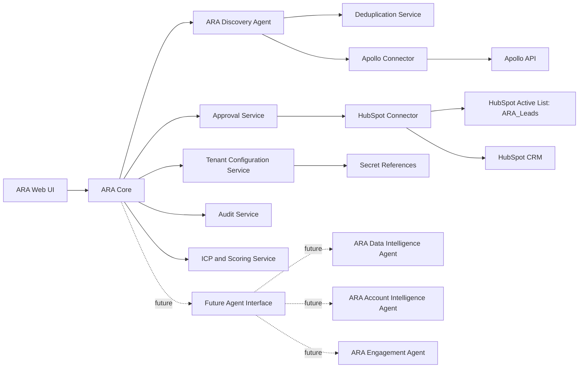

# ARA Target Architecture

## Purpose

ARA - Autonomous Revenue Architects is a Freelan-owned revenue generation platform. ARA 0.1 evolves the current Apollo to HubSpot importer into a safer, modular, multi-tenant-ready system centered on the ARA Discovery Agent.

ARA starts as an internal Freelan tool, but its architecture must support a future plug and play model where each client connects its own Apollo and HubSpot accounts.

## Incremental Target Architecture

## Services

### ARA Core

Responsibilities:

- Owns run lifecycle.
- Enforces tenant context on every operation.
- Coordinates Discovery, Approval, Audit, Scoring and HubSpot sync.
- Exposes HTTP API to the UI.
- Does not call Apollo or HubSpot directly once connectors are extracted.

Current source basis:

- `src/server.js`
- `src/agent.js`

Target action: `REFACTOR`.

### ARA Discovery Agent

Responsibilities:

- Converts approved ICP criteria into Apollo discovery requests.
- Calls Apollo Connector.
- Normalizes candidate contacts and companies.
- Produces candidate evidence.
- Sends candidates to Scoring and Deduplication.
- Does not write to HubSpot directly.

Current source basis:

- `findApolloCandidates()`
- `normalizeCandidate()`
- parts of `approveRoles()`
- `interpretFilters()`

Target action: `REFACTOR`.

### Tenant Configuration Service

Responsibilities:

- Loads tenant-specific settings.
- Provides credential references, not raw secrets.
- Provides HubSpot mappings, list configuration, ICP defaults, scoring thresholds, approval rules and feature flags.
- Enforces that every request has `tenant_id`.

Current source basis: none.

Target action: `REPLACE` with a new component.

### Apollo Connector

Responsibilities:

- Encapsulates Apollo API calls.
- Applies tenant-specific Apollo credential reference.
- Handles retries, timeouts, rate limits and provider errors.
- Returns normalized provider responses or typed connector errors.

Current source basis:

- `apollo()`
- `findApolloCandidates()`

Target action: `REFACTOR`.

### HubSpot Connector

Responsibilities:

- Encapsulates HubSpot API calls.
- Uses tenant-specific HubSpot credential reference.
- Creates or updates contacts and companies idempotently.
- Writes `ara_*` properties.
- Supports `ARA_Leads` active list membership by updating contact properties, not by manually adding contacts to the list.

Current source basis:

- `hubspot()`
- `searchOne()`
- `createObject()`
- `fillBlankProperties()`
- `associate()`
- `importCandidate()`

Target action: `REFACTOR`.

### ICP and Scoring Service

Responsibilities:

- Computes `ara_icp_score`, `ara_contact_score`, `ara_opportunity_score` and `ara_data_confidence`.
- Produces explainable score evidence.
- Applies tenant-specific scoring rules.

Current source basis:

- OpenAI interpretation and context generation only.

Target action: new service with partial reuse of `interpretFilters()`.

### Deduplication Service

Responsibilities:

- Deduplicates within a run and against HubSpot.
- Detects duplicates by email, domain, Apollo ID and tenant-specific rules.
- Produces `DUPLICATE_FOUND` states and evidence.

Current source basis:

- `uniqueByEmail()`
- HubSpot lookup by email/domain.

Target action: `REFACTOR`.

### Audit Service

Responsibilities:

- Append-only event trail.
- Records `tenant_id`, actor, action, run, service, input hash, sanitized output, provider and result.
- Supports operational reports and compliance review.

Current source basis:

- `import_runs` JSONB state.
- `/api/audit/latest-import`.

Target action: `REFACTOR`.

### Approval Service

Responsibilities:

- Replaces fixed `APPROVAL_CODE`.
- Supports Operator, Admin and Commercial Approver.
- Stores approval scope, expiry, actor and reason.
- Gates sensitive actions: final imports, high volume operations, HubSpot writes, state overrides.

Current source basis:

- `APPROVAL_CODE` in `executeFinal()`.

Target action: `REPLACE`.

### Future Agent Interface

Responsibilities:

- Defines a stable contract for future agents.
- Accepts tenant-aware input and returns typed output, evidence and audit metadata.
- Does not require deep design for ARA 0.1.

Prepared future agents:

- ARA Data Intelligence Agent.
- ARA Account Intelligence Agent.
- ARA Engagement Agent.

Engagement Agent must not send emails in ARA 0.1.

## Cross-cutting Rules

- Every operation includes `tenant_id`.
- Every query is filtered by `tenant_id`.
- Every audit event stores `tenant_id`.
- No credentials are stored directly in ordinary database tables.
- No tenant can access another tenant's cache, logs, candidates, runs or audit events.
- Latenode is optional and not part of the critical path for ARA 0.1.

