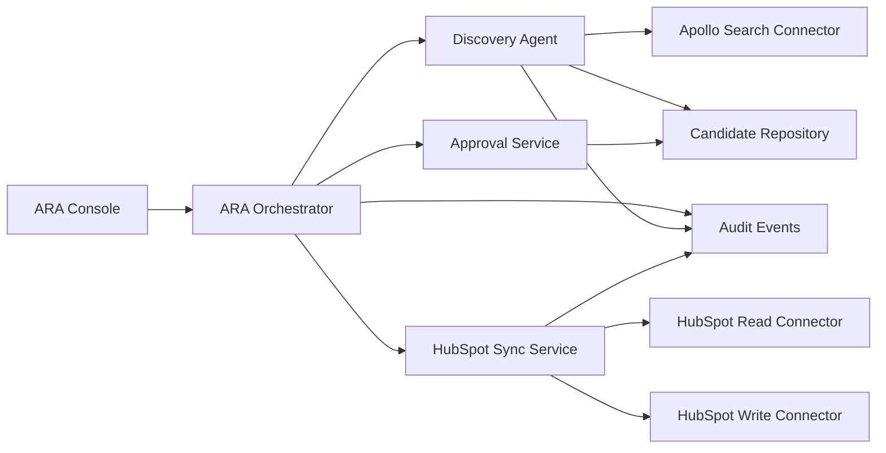

# Connector Contracts

## Component Architecture



## Common Connector Context

```json
{
  "tenant_id": "freelan",
  "correlation_id": "uuid",
  "external_services_mode": "mock",
  "write_mode": "disabled",
  "idempotency_key": "tenant:operation:id",
  "actor": {
    "type": "system",
    "id": "orchestrator"
  }
}
```

## Apollo Search Connector

Capabilities:

- Search organizations.
- Search people.
- Retrieve paginated results.
- Return normalized external records.
- Report rate limits.
- Report estimated credit use.
- Support mock, sandbox and live modes.
- Never write to Apollo.

Interface sketch:

```ts
searchPeople(criteria, page, context) -> {
  records: ApolloPersonRecord[],
  page,
  has_more,
  rate_limit,
  estimated_credits
}
```

Current reusable code:

- Payload construction in `findApolloCandidates()`.
- `normalizeCandidate()`.
- Rate-limit classification.

Required split:

- Payload builder.
- Provider caller.
- Normalizer.
- Eligibility/scoring outside connector.

## Apollo Enrichment Connector

Future only:

- Enrich organization.
- Enrich person.
- Report credit use.
- Avoid duplicate enrichments.

No B1/B2 enrichment behavior.

## HubSpot Read Connector

Capabilities:

- Find contact by email.
- Find contact by Apollo ID.
- Find company by domain.
- Find company by Apollo organization ID.
- Read current contact/company properties.
- Read owner.
- Read lifecycle and exclusion information.
- Detect open opportunity or existing customer relationship.

## HubSpot Write Connector

Capabilities:

- Create or update company.
- Create or update contact.
- Associate contact and company.
- Create lead record when supported.
- Create note.
- Create task.
- Upload file in future.
- Update `ara_*` properties in future.

Every write requires:

- Approval reference.
- Correlation ID.
- Write guard.
- Idempotency key.
- Tenant context.
- Audit event.

Discovery Agent must not call HubSpot Write Connector directly.

