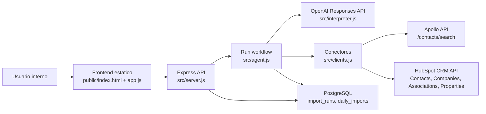

# Arquitectura Actual

## Vista general

El sistema actual es una aplicacion web monolitica Node.js/Express. Sirve frontend estatico, expone API HTTP, guarda estado en PostgreSQL y se conecta directamente con Apollo, HubSpot y OpenAI desde el mismo proceso.

## Componentes

| Componente | Ubicacion | Responsabilidad actual | Estado |
|---|---|---|---|
| Servidor Express | `src/server.js` | HTTP API, static assets, healthcheck, route wrapper | Activo |
| Workflow agentico | `src/agent.js` | Estados del run, validacion, busqueda, test, importacion | Activo |
| Conectores Apollo/HubSpot | `src/clients.js` | Requests externos, normalizacion, mapeo HubSpot | Activo |
| Interpretador OpenAI | `src/interpreter.js` | Expansion semantica de ICP a filtros Apollo | Activo |
| Persistencia | `src/db.js` | Inicializa tablas, guarda runs, limite diario | Activo |
| Configuracion | `src/config.js` | Variables de entorno y secretos normalizados | Activo |
| UI | `public/` | Chat/formulario simple y control del flujo | Activo |
| Pruebas | `test/phone-mapping.test.js` | Prueba mapeo telefonico | Activo, cobertura limitada |
| Configure endpoint | `POST /api/runs/:id/configure` | Guarda filtros/roles sin OpenAI | Probable legado, no usado por UI actual |

## Dependencias runtime

- Node.js >= 20.
- Express 5.1.
- pg 8.16.
- PostgreSQL.
- Apollo API key.
- HubSpot Private App token o access token compatible.
- OpenAI API key.
- Railway para despliegue actual.

## Codigo activo vs legado/experimental

### Activo

- `POST /api/runs`
- `POST /api/runs/:id/analyze`
- `POST /api/runs/:id/approve-roles`
- `POST /api/runs/:id/relax`
- `POST /api/runs/:id/test`
- `POST /api/runs/:id/import`
- `GET /api/audit/latest-import`
- `GET /health`

### Probable legado

- `POST /api/runs/:id/configure`: existe en backend, pero `public/app.js` no lo llama. Parece una etapa previa al flujo con OpenAI.

### Experimental o utilitario

- `POST /api/setup/hubspot-properties`: util para bootstrap, pero riesgoso como endpoint expuesto porque crea propiedades en HubSpot.
- Diagnosticos OpenAI/HubSpot: utiles para operacion, pero requieren proteccion.

## Limitaciones arquitectonicas

- Monolito sin separacion entre UI, orquestacion, conectores, auditoria y aprobaciones.
- No hay contratos formales entre modulos.
- No hay colas, workers, jobs asincronos ni persistencia de eventos.
- El proceso HTTP hace llamadas externas e importaciones secuenciales.
- No hay frontera de seguridad por rol/usuario.

## Encaje con ARA

El sistema actual puede ser base del **ARA Discovery Agent**, no del orquestador completo. Para ARA, la logica de busqueda Apollo y normalizacion debe aislarse como servicio/connector reusable, mientras HubSpot writeback deberia moverse a un **HubSpot Connector** gobernado por **Approval Service** y **Audit Service**.

