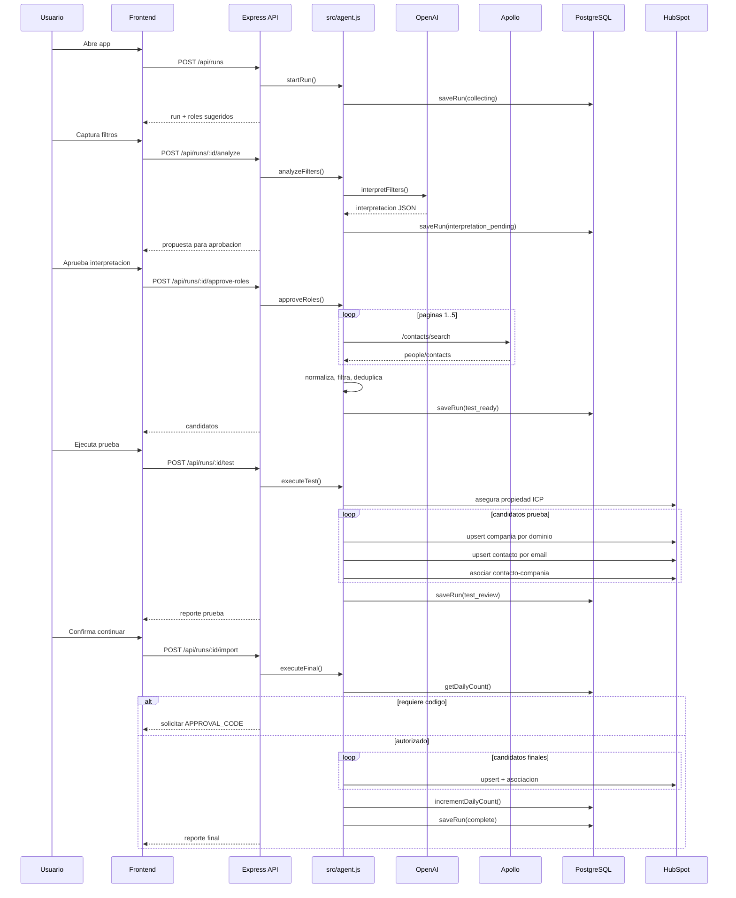

# Flujo Actual De Datos

## Diagrama del flujo

## Datos capturados desde UI

- `industry`: una industria principal.
- `employeeMin`, `employeeMax`: rango numerico.
- `countries`: arreglo derivado de texto separado por coma.
- `quantity`: contactos finales a importar despues de prueba.
- `roles`: maximo 3 roles.
- `adHocBrief`: brief libre para ajustar interpretacion.

## Datos generados por OpenAI

- `industryKeywords`.
- `roleTitles`.
- `seniorities`.
- `companyKeywords`.
- `contactLocations`.
- `excludedTitles`.
- `explanation`.
- `relaxation`.

## Datos obtenidos de Apollo

Despues de normalizacion:

- `apolloId`.
- Nombre, apellido, email, status de email.
- Titulo.
- LinkedIn.
- Ciudad, estado, pais.
- Telefonos validos.
- Compania: nombre, dominio, website, telefono, ubicacion, LinkedIn, empleados, keywords.

## Datos escritos en HubSpot

### Contacto

- `firstname`
- `lastname`
- `email`
- `jobtitle`
- `company`
- `hs_linkedin_url`
- `city`
- `state`
- `country`
- `phone`
- `hs_whatsapp_phone_number`
- `freelan_icp_match_context`

### Compania

- `name`
- `domain`
- `website`
- `phone`
- `city`
- `state`
- `country`
- `zip`
- `linkedin_company_page`
- `numberofemployees`
- `apollo_company_keywords`

### Asociacion

- Asociacion default `contacts -> companies` por IDs HubSpot.

## Datos locales guardados

Tabla `import_runs`:

- `id`
- `created_at`
- `updated_at`
- `phase`
- `filters`
- `roles`
- `candidates`
- `test_results`
- `final_results`

Tabla `daily_imports`:

- `day_key`
- `imported_count`
- `updated_at`

## Observaciones de flujo

- La prueba de 5 contactos escribe en HubSpot.
- La prueba no aumenta `daily_imports`.
- La importacion final no intenta completar automaticamente faltantes con nuevas busquedas; la UI ofrece "Buscar e integrar faltantes", que vuelve al flujo de busqueda.
- La deduplicacion local de candidatos ocurre por email.
- La deduplicacion en HubSpot ocurre por busqueda previa: contactos por `email`, companias por `domain`.

