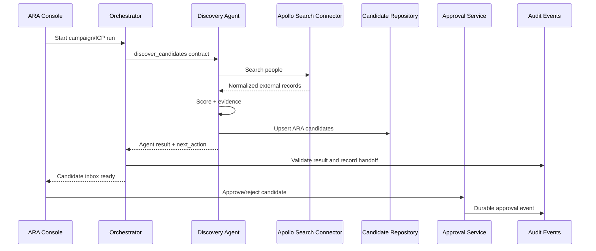
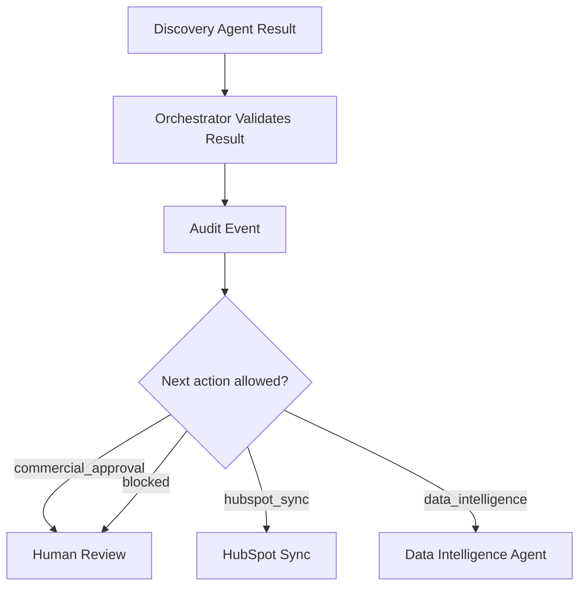

# Orchestrator Responsibilities

## Owns

- Create or resume runs.
- Invoke agents.
- Pass versioned contracts.
- Validate results.
- Update execution state.
- Select next action.
- Route human-review tasks.
- Enforce stop conditions.
- Retry transient errors.
- Prevent duplicate execution.
- Record audit events.

## Does Not Own

- Apollo API details.
- HubSpot API details.
- PDF generation.
- Sales email generation.
- All business rules.
- Approval bypass.

## Discovery-To-Approval Sequence

## Multiagent Handoff

## Synchronous MVP

ARA 0.1 may invoke agents synchronously inside HTTP/service calls. Contracts still include IDs, state and retry metadata so future workers can consume the same envelope.

