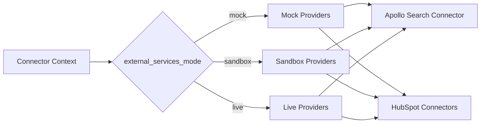

# Provider Selection

## Variable

`ARA_EXTERNAL_SERVICES_MODE=mock | sandbox | live`

## Modes

### mock

- Deterministic fixtures.
- No external calls.
- No credits.
- No writes.
- Required for first staging validation.

### sandbox

- Controlled credentials.
- Limited real calls.
- No production records.
- Write mode disabled or preview initially.
- Requires explicit approval.

### live

- Production credentials.
- Explicit authorization.
- Audit required.
- Write guard required.
- Not enabled during B1.

## Provider Factory Strategy

## Rules

- Do not use global mutable clients in new connector code.
- Resolve providers per execution context.
- Context must include `tenant_id`.
- MVP tenant is `freelan`, resolved centrally from `ARA_DEFAULT_TENANT_ID`.
- Tenant-specific secrets are future work.
- `live` must never bypass write guard or approval.

